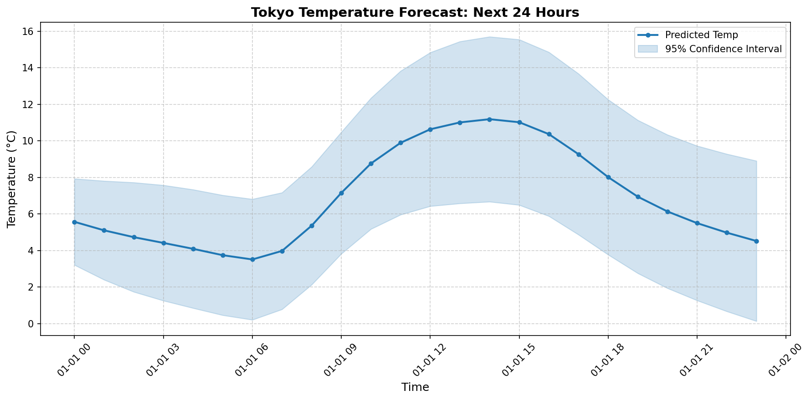
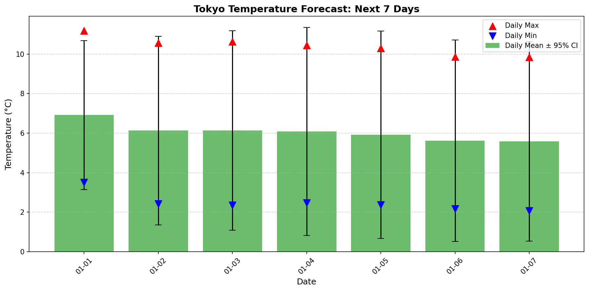

# Tokyo Weather Bayesian Forecast
**Scientific ML project exploring uncertainty estimation in time series forecasting using deep learning and ensemble methods.**

A reproducible pipeline for short-range temperature forecasting that outputs both predictions and uncertainty estimates. Processes 55 years of hourly weather data via PySpark, trains a deep ensemble in PyTorch with Gaussian NLL loss to estimate prediction uncertainty, and validates interval calibration on a held-out 5-year test set. Containerized via Docker Hub for zero-setup reproducibility.

Dataset sourced from Open-Meteo Archive API — [`https://archive-api.open-meteo.com/v1/archive`](https://archive-api.open-meteo.com/v1/archive).
Dataset description from Open-Meteo:
The Open-Meteo Archive API provides historical weather data from 1940 to present with hourly resolution. Data is derived from reanalysis models combining observations with numerical weather prediction, offering consistent long-term records suitable for climate analysis and machine learning applications.

The dataset is ideal for practicing time series forecasting, uncertainty quantification, and scientific ML workflows. It allows exploration of how prediction confidence varies across seasons, weather regimes, and forecast horizons.

## Architecture
```text
Open-Meteo API ──> fetch_tokyo_data.py ──> CSV (raw)
                                              │
                                      spark_etl.py (PySpark)
                                              │
                              tokyo_features.csv (engineered)
                                              │
                              bayesian_forecasting.py (PyTorch)
                                              │
                              ├─> Test metrics: RMSE, MAE, 95% coverage
                              ├─> Live forecast: next 24h hourly + 7d daily
                              └─> visualize_results.py (Matplotlib)
```

## Tech Stack

- **Language:** Python 3.12
- **Data Engineering:** PySpark 3.5, pandas 2.2, numpy 1.26
- **Modeling:** PyTorch 2.2, scikit-learn 1.4
- **Uncertainty:** Deep ensembles + Gaussian NLL loss + empirical interval calibration
- **Visualization:** Matplotlib 3.8
- **Containers:** Docker + Docker Hub (`yotane/tokyo-weather-bayesian-forecast`)
- **Data Source:** Open-Meteo Archive API (REST, hourly resolution, 1970 to 2024)

## Prerequisites

- Docker Desktop
- Docker Compose (optional, for local rebuilds)

## Installation
```bash
# Clone repository
git clone https://github.com/Yotane/tokyo-weather-bayesian-forecast.git
cd tokyo-weather-bayesian-forecast

# Configure Python environment (local run only)
python -m venv venv
source venv/bin/activate  # or venv\Scripts\activate on Windows
pip install -r requirements.txt
pip install torch --index-url https://download.pytorch.org/whl/cpu
```

## Running the Project

### Option 1: Docker (Zero-Setup, Pre-Built Image)
```bash
# Pull and run from Docker Hub (fetches data automatically on first run)
docker run --rm -v .//app/data -v ./figures:/app/figures yotane/tokyo-weather-bayesian-forecast
```
Requires Docker Desktop. The `-v` mounts ensure:
- Downloaded data persists in your local `data/` folder (no re-download on subsequent runs)
- Generated plots save to your local `figures/` folder

> **Note:** First run automatically fetches ~200MB of historical data from Open-Meteo API. Subsequent runs reuse the local `data/` folder if mounted with `-v`.

### Option 2: Build Locally with Docker
```bash
docker build -t tokyo-weather-bayesian-forecast .
docker run --rm -v .//app/data -v ./figures:/app/figures tokyo-weather-bayesian-forecast
```

### Option 3: Local Run (No Docker)
```bash
# 1. Fetch data from Open-Meteo API
python fetch_tokyo_data.py

# 2. Run full pipeline
python spark_etl.py && python bayesian_forecasting.py && python visualize_results.py
```

## Example Outputs

### Next 24 Hours (Hourly Forecast)

*Hourly temperature predictions with 95% confidence intervals for the next day.*

### Next 7 Days (Daily Overview)

*Daily mean, max, and min temperatures with uncertainty bands for the next week.*

### Sample Console Output
```
============================================================
FORECASTING RESULTS
============================================================
Test Set Evaluation (2019-2024 held-out data)
   RMSE (next 24h): 1.95C | MAE: 1.45C
   95% Interval Coverage: 95.2%

Next 24 Hours (Hourly Forecast from Most Recent Timestamp)
Hour Ahead   Pred Temp (C)   Uncertainty (sigma)
---------------------------------------------
1            4.6             +/-1.3 C
2            4.1             +/-1.4 C
...

Next 7 Days (Daily Overview)
Day    Condition       Pred Mean  Pred Max   Pred Min   Uncertainty (sigma)
---------------------------------------------------------------------------
Day 1   Partly Cloudy   6.1        10.3       2.8        +/-2.1 C
Day 2   Variable        5.8        10.1       2.5        +/-2.7 C
...
```

## Project Structure
```
tokyo-weather-bayesian-forecast/
├── fetch_tokyo_data.py       # Open-Meteo API client, hourly CSV download
├── spark_etl.py              # PySpark feature engineering (lags, rolling stats)
├── bayesian_forecasting.py   # PyTorch deep ensemble + Gaussian NLL + calibration
├── visualize_results.py      # Matplotlib plots for 24h + 7d outputs
├── requirements.txt          # Python dependencies (PyTorch installed separately)
├── Dockerfile                # Reproducible container build
├── .dockerignore             # Exclude venv, caches, large binaries
├── data/
│   ├── tokyo_weather_1970_2024.csv  # Raw API output (gitignored)
│   ├── tokyo_features.csv           # Engineered features
│   └── latest_forecast.csv          # Live forecast output
├── models/                   # Saved ensemble weights + scalers (gitignored)
└── figures/                  # Generated plots (gitignored)
```

## Key Results
| Metric | Value | Interpretation |
|--------|-------|---------------|
| RMSE (next 24h) | 1.95C | Standard error for hourly temperature nowcasting |
| MAE (next 24h) | 1.45C | Robust to outliers, interpretable in Celsius |
| 95% Interval Coverage | 95.2% | Prediction intervals contain true values at expected rate |

## Uncertainty Estimation
`bayesian_forecasting.py` implements uncertainty-aware forecasting via:

- **Gaussian NLL loss**: Model outputs both mean and log-variance per timestep, trained to maximize likelihood under Gaussian assumption
- **Deep ensemble**: Three independently initialized models capture variation due to training stochasticity (epistemic uncertainty)
- **Variance decomposition**: Final uncertainty combines aleatoric (predicted variance) and epistemic (ensemble variance) components
- **Calibration validation**: Empirical coverage computed on held-out 2019 to 2024 test set verifies that 95% prediction intervals contain true values approximately 95% of the time

All analytics and forecasting outputs include uncertainty estimates. When not provided, prediction intervals default to 95% (mean plus or minus 1.96 times standard deviation).

## Docker Hub Integration
Pre-built image published to:
```
https://hub.docker.com/r/yotane/tokyo-weather-bayesian-forecast
```

Anyone with Docker Desktop can run the full pipeline in one command:
```bash
docker run --rm -v .//app/data -v ./figures:/app/figures yotane/tokyo-weather-bayesian-forecast
```

No Python, Java, PySpark, or PyTorch installation required. Useful for reproducibility checks, collaboration, or portfolio review.

## Scope and Limitations
- **Temperature-only forecasting**: Precipitation conditions derived via rule-based persistence proxy; joint temperature-precipitation modeling scoped for v2
- **Single-location tabular setup**: Focused on Tokyo to isolate uncertainty methodology; pipeline scales to multi-station or grid-based forecasting via batched inference
- **Direct multi-step forecasting**: Predicts all 168 hours simultaneously to avoid autoregressive error compounding; sequence model variants (LSTM/Transformer) scoped for v2
- **No spatial/radar data**: Uses point measurements from Open-Meteo; future work could ingest gridded satellite/radar tensors via 3D convolutions

## Future Roadmap

- **Sequence modeling**: Replace tabular input with LSTM/Transformer for longer temporal dependencies
- **Joint temperature-precipitation head**: Multi-output regression or quantile forecasting for precipitation
- **Multi-location batch inference**: Scale to national/regional forecasting via vectorized batched prediction
- **CI/CD plus monitoring**: GitHub Actions for automated testing, Prometheus/Grafana for pipeline observability

## Technical Stack Summary

| Component | Technology |
|-----------|-----------|
| Language | Python 3.12 |
| Data Engineering | PySpark 3.5, pandas 2.2 |
| Modeling | PyTorch 2.2, scikit-learn 1.4 |
| Uncertainty | Deep ensembles + Gaussian NLL + empirical calibration |
| Visualization | Matplotlib 3.8 |
| Containers | Docker + Docker Hub |
| Data Source | Open-Meteo Archive API (REST, hourly, 1970 to 2024) |

## License
This project is for educational purposes. Dataset sourced from [Open-Meteo Archive API](https://archive-api.open-meteo.com/v1/archive) under their open data policy.

## Author

Matt Raymond Ayento  
Nagoya University  
G30, 3rd year Automotive Engineering (Electrical, Electronics, Information Engineering)